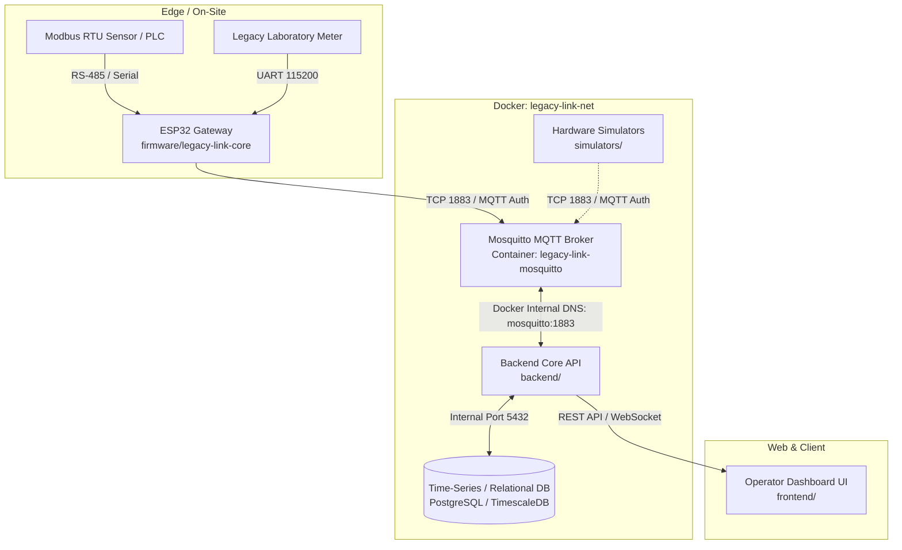

# Infrastructure Architecture & Design Notes

> **Role:** Technical reference document detailing network topology, MQTT communication flows, topic conventions, and future service extensibility for the **Legacy-link** project.  
> **Audience:** Firmware engineers, backend developers, infrastructure engineers, and system integrators.

---

## English

### 1. System Overview & Problem Context
In industrial and laboratory environments, legacy equipment (PLCs, sensors, meters) typically communicates via serial protocols such as **Modbus RTU over RS-485 or UART**. These devices cannot directly connect to modern web services or cloud platforms.

**Legacy-link** solves this by using a low-cost microcontroller gateway (ESP32) running custom firmware (`firmware/legacy-link-core`). The gateway reads raw serial frames, translates them into structured JSON payloads, and forwards them over the local network via **MQTT**.

The infrastructure layer hosts the containerized **Eclipse Mosquitto MQTT Broker**, which acts as the decoupled, real-time message bus uniting edge devices, backend services, and testing simulators.

---

### 2. Network Topology & System Architecture



---

### 3. End-to-End Data Communication Flows

#### Flow A: Telemetry Ingestion (Upstream)
1. **Periodic Polling:** ESP32 polls Modbus slave registers over RS-485 at configured intervals.
2. **JSON Serialization:** Gateway parses raw byte registers and wraps values into a JSON schema with timestamp and device ID.
3. **MQTT Publish:** ESP32 publishes the payload to `legacy-link/devices/{device_id}/telemetry` on port 1883 with `QoS 0` or `QoS 1`.
4. **Backend Processing:** Backend service subscribes to `legacy-link/devices/+/telemetry`, processes records, and stores data in the time-series database.

#### Flow B: Control & Commands (Downstream)
1. **Operator Action:** User triggers a control action on the frontend dashboard (e.g., toggle relay, write holding register).
2. **Backend Dispatch:** Backend publishes a command JSON to `legacy-link/devices/{device_id}/commands` with `QoS 1`.
3. **Gateway Execution:** The target ESP32 receives the command, writes values to the Modbus device over RS-485, and publishes an acknowledgment back to `legacy-link/devices/{device_id}/ack`.

#### Flow C: Device Presence & Liveness (Last Will and Testament - LWT)
- When connecting, the ESP32 registers an MQTT **Last Will** message on `legacy-link/devices/{device_id}/status` with payload `{"online": false}`.
- Upon successful connect, it publishes `{"online": true}` with `retain: true`.
- If the hardware loses power or WiFi unexpectedly, the Mosquitto broker automatically broadcasts the Last Will message to inform the backend immediately.

---

### 4. Communication Ports & Protocols
| Service / Container | Port (Host:Container) | Protocol | Scope & Usage |
| :--- | :--- | :--- | :--- |
| **Mosquitto MQTT** | `1883:1883` | TCP / MQTT | Primary communication bus for ESP32 gateway, backend services, and simulators. |
| **Mosquitto WebSockets** | `9001:9001` *(Optional)* | TCP / WS | Reserved for optional direct browser telemetry streaming if needed. |
| **Future Backend** | `8000:8000` *(Tentative)* | HTTP / WS | RESTful configuration API and real-time dashboard sockets. |
| **Future Database** | `5432:5432` *(Internal)* | TCP | Persistent storage for sensor logs and device registry. Not exposed to public host. |

---

### 5. MQTT Topic Conventions & Payload Standards

| Topic Pattern | Direction | QoS | Description & Payload Example |
| :--- | :---: | :---: | :--- |
| `legacy-link/devices/{id}/telemetry` | Gateway $\to$ Broker | 0 or 1 | **Sensor Readings:** `{"device_id":"esp32_01","timestamp":1725400000,"data":{"temp":28.5,"pressure":101.3}}` |
| `legacy-link/devices/{id}/status` | Gateway $\to$ Broker | 1 (Retained) | **Liveness / LWT:** `{"device_id":"esp32_01","online":true,"uptime_sec":1240}` |
| `legacy-link/devices/{id}/commands` | Backend $\to$ Gateway | 1 | **Control Instructions:** `{"cmd_id":"c123","action":"write_register","address":40001,"value":100}` |
| `legacy-link/devices/{id}/ack` | Gateway $\to$ Broker | 1 | **Command Result:** `{"cmd_id":"c123","status":"success","error":null}` |
| `legacy-link/system/broadcast` | Backend $\to$ All | 1 | **System Notice:** Broadcast firmware upgrade notifications or emergency stop signals. |

---

### 6. Security & Credential Isolation
- **Anonymous Access Disabled:** Set `allow_anonymous false` in `mosquitto.conf`.
- **Role-Based Accounts:**
  - `esp32_gateway`: Restricted to publishing telemetry and subscribing to its own command topic.
  - `backend_service`: Full subscribe access (`legacy-link/#`) to ingest data and dispatch commands.
  - `simulator_client`: Dedicated test user for simulator verification.
- **Credential Storage:**
  - Passwords are encrypted/hashed via SHA512-PBKDF2 in `mosquitto/config/passwd`.
  - The actual `passwd` file and `.env` are strictly excluded from version control via `.gitignore`.

---

## Tiếng Việt

### 1. Bối cảnh dự án & Bài toán giải quyết
Trong các nhà máy, xưởng sản xuất hay phòng thí nghiệm hiện nay, có rất nhiều thiết bị đời cũ (máy đo, cảm biến, biến tần, PLC) sử dụng chuẩn giao tiếp nối tiếp công nghiệp như **Modbus RTU qua RS-485 hoặc UART**. Các thiết bị này không có kết nối Internet/WiFi và không thể gửi dữ liệu trực tiếp lên các phần mềm hay nền tảng web hiện đại.

Dự án **Legacy-link** đóng vai trò làm một **cầu nối (Gateway)** giá rẻ:
- **Phía dưới (Edge):** Dùng vi điều khiển ESP32 đọc các thanh ghi dữ liệu Modbus RTU từ thiết bị cũ qua đường dây nối tiếp RS-485.
- **Phía trên (Hạ tầng & Ứng dụng):** ESP32 đóng gói dữ liệu thành định dạng JSON tiêu chuẩn và gửi qua WiFi/Ethernet lên hệ thống thông qua giao thức **MQTT**.

Hạ tầng (`infrastructure/`) cung cấp **Mosquitto MQTT Broker** chạy trên nền Docker. Đây là "trạm trung chuyển dữ liệu" trung tâm, giúp kết nối phần cứng ESP32, dịch vụ Backend và các bộ giả lập phần mềm một cách độc lập và đồng bộ.

---

### 2. Sơ đồ kiến trúc & Phân tầng hệ thống

Hệ thống được chia làm 3 tầng rõ rệt:

1. **Tầng phần cứng & Ngoại vi (Hardware & Edge Layer):**
   - Các thiết bị công nghiệp thế hệ cũ phát tín hiệu nối tiếp (Modbus RTU / RS-485 hoặc UART tốc độ 115200 baud).
   - ESP32 Gateway chạy firmware (`firmware/legacy-link-core`) thực hiện quét (polling) chu kỳ, đọc các thanh ghi dữ liệu và chuyển đổi thành JSON.

2. **Tầng hạ tầng & Dịch vụ (Infrastructure Layer - Docker):**
   - Toàn bộ dịch vụ chạy trong mạng Docker cô lập (`legacy-link-net`).
   - **Mosquitto Broker (Port 1883):** Tiếp nhận bản tin từ ESP32, kiểm tra xác thực tài khoản, định tuyến và phân phối tin nhắn đến các bên quan tâm (Backend, Simulators).
   - **Backend Service:** Đăng ký nhận (Subscribe) dữ liệu từ Mosquitto để xử lý nghiệp vụ, kiểm tra cảnh báo và lưu trữ vào cơ sở dữ liệu.
   - **Database (Tương lai):** Cơ sở dữ liệu chuỗi thời gian (TimescaleDB / InfluxDB hoặc PostgreSQL) để lưu trữ lịch sử chỉ số cảm biến theo thời gian.

3. **Tầng giao diện người dùng (Application Layer):**
   - Giao diện Dashboard (`frontend/`) kết nối với Backend thông qua REST API hoặc WebSocket để hiển thị biểu đồ, trạng thái thiết bị và cho phép người vận hành gửi lệnh điều khiển.

---

### 3. Chi tiết 3 luồng giao tiếp dữ liệu cốt lõi

#### Luồng 1: Thu thập chỉ số cảm biến (Telemetry Upstream)
```
[Cảm biến / PLC]
       │  (Modbus RTU / RS-485)
       ▼
[ESP32 Gateway]
       │  (JSON qua MQTT Port 1883: legacy-link/devices/{id}/telemetry)
       ▼
[Mosquitto Broker]
       │  (Phân phối nội bộ Docker)
       ▼
[Backend Service] ──► [Lưu trữ vào Cơ sở dữ liệu]
```
- ESP32 định kỳ (ví dụ mỗi 1 giây hoặc 5 giây) gửi bản tin đọc được từ thanh ghi Modbus lên Broker.
- Sử dụng mức chất lượng dịch vụ **QoS 0** (nếu dữ liệu gửi liên tục, chấp nhận rớt gói hiếm hoi) hoặc **QoS 1** (đảm bảo dữ liệu quan trọng không bị mất).

#### Luồng 2: Điều khiển thiết bị ngược từ xa (Command Downstream)
```
[Giao diện Người dùng (Dashboard)]
       │  (Bấm nút bật/tắt hoặc nhập giá trị cài đặt)
       ▼
[Backend Service]
       │  (Publish lệnh qua MQTT: legacy-link/devices/{id}/commands)
       ▼
[Mosquitto Broker]
       │  (Đẩy tin đến đúng ESP32 đang Subscribe)
       ▼
[ESP32 Gateway]
       │  (Ghi xuống Modbus RTU / RS-485 điều khiển máy móc)
       ▼
[Gửi phản hồi ACK]: Bắn lại kết quả thành công/thất bại lên topic `.../ack`
```
- Giúp người vận hành từ xa có thể thay đổi tham số máy móc hoặc bật/tắt thiết bị mà không cần xuống tận xưởng.
- Luồng lệnh này **bắt buộc sử dụng QoS 1** để đảm bảo gói tin điều khiển phải đến được tay gateway.

#### Luồng 3: Giám sát trạng thái hoạt động & Xử lý mất mạng (LWT - Last Will and Testament)
- Thiết bị công nghiệp có thể bị mất nguồn đột ngột hoặc đứt cáp mạng. Để hệ thống nhận biết thiết bị còn sống hay đã chết:
  1. Lúc ESP32 vừa kết nối tới Mosquitto, nó đăng ký một tin nhắn "Di chúc" (Last Will) trên topic `legacy-link/devices/{device_id}/status` với nội dung `{"online": false}`.
  2. Ngay sau khi kết nối thành công, ESP32 chủ động bắn bản tin `{"online": true}` (bật cờ `retain: true` để người kết nối sau vẫn đọc được trạng thái mới nhất).
  3. Nếu ESP32 bị sập nguồn bất ngờ, Broker phát hiện timeout và sẽ **tự động phát tán bản tin Di chúc `{"online": false}`** đến Backend để hiển thị cảnh báo thiết bị offline lên Dashboard.

---

### 4. Bảng phân bổ cổng mạng (Network Ports)

| Dịch vụ | Cổng ánh xạ (Host:Container) | Giao thức | Ý nghĩa & Đối tượng sử dụng |
| :--- | :---: | :---: | :--- |
| **Mosquitto MQTT** | `1883:1883` | TCP / MQTT | Cổng chính cho ESP32 ngoài đời thực kết nối vào, đồng thời backend và simulators cũng kết nối qua cổng này. |
| **Mosquitto WebSocket** | `9001:9001` | TCP / WS | *(Tùy chọn tương lai)* Cổng mở nếu frontend dashboard muốn nhận luồng dữ liệu thời gian thực trực tiếp từ broker. |
| **Backend API** | `8000:8000` *(Dự kiến)* | HTTP / WS | Cung cấp REST API cấu hình thiết bị và WebSocket cho giao diện quản trị. |
| **Database** | `5432` *(Chỉ nội bộ Docker)* | TCP | Cổng cơ sở dữ liệu PostgreSQL/TimescaleDB. Không cần mở ra máy host để đảm bảo bảo mật. |

---

### 5. Quy chuẩn cấu trúc Topic MQTT (Topic Hierarchy)

Việc đặt tên topic rõ ràng giúp hệ thống dễ mở rộng khi có hàng trăm thiết bị cùng kết nối:

1. **Gửi dữ liệu đo đạc (Telemetry):**
   * **Topic:** `legacy-link/devices/{device_id}/telemetry`
   * **Ví dụ:** `legacy-link/devices/esp32_gateway_01/telemetry`
   * **Nội dung mẫu (Payload):**
     ```json
     {
       "device_id": "esp32_gateway_01",
       "timestamp": 1725400123,
       "metrics": {
         "temperature": 45.2,
         "current_amperes": 3.15,
         "status_code": 0
       }
     }
     ```

2. **Trạng thái kết nối (Device Status & LWT):**
   * **Topic:** `legacy-link/devices/{device_id}/status`
   * **Nội dung mẫu:**
     ```json
     {
       "device_id": "esp32_gateway_01",
       "online": true,
       "firmware_version": "1.0.0",
       "ip_address": "192.168.1.50"
     }
     ```

3. **Lệnh điều khiển xuống Gateway (Downstream Commands):**
   * **Topic:** `legacy-link/devices/{device_id}/commands`
   * **Nội dung mẫu:**
     ```json
     {
       "command_id": "cmd_98765",
       "action": "write_register",
       "register_address": 40002,
       "value": 1
     }
     ```

4. **Xác nhận thực thi lệnh (Command Acknowledgment):**
   * **Topic:** `legacy-link/devices/{device_id}/ack`
   * **Nội dung mẫu:**
     ```json
     {
       "command_id": "cmd_98765",
       "success": true,
       "executed_at": 1725400125,
       "error_message": null
     }
     ```

---

### 6. Kiến trúc bảo mật & Quản lý thông tin nhạy cảm
- **Vô hiệu hóa truy cập tự do:** Bật `allow_anonymous false` trong `mosquitto.conf`. Bất kỳ kết nối nào không cung cấp tài khoản đều bị Broker từ chối lập tức.
- **Phân tách tài khoản chuyên biệt:**
  - `esp32_gateway`: Tài khoản nạp vào firmware ESP32, chỉ có quyền gửi tin vào topic thiết bị của mình.
  - `backend_service`: Tài khoản backend, có quyền bao quát toàn bộ topic `legacy-link/#`.
  - `simulator_client`: Tài khoản phục vụ cho các script test giả lập thiết bị.
- **Mã hóa và cô lập mật khẩu:**
  - Mật khẩu được mã hóa băm (SHA512-PBKDF2) trong file `mosquitto/config/passwd`.
  - File mật khẩu thật và file môi trường `.env` tuyệt đối **không được đẩy lên Git** (đã được cấu hình chặn trong file [infrastructure/.gitignore](file:///home/james/Projects/Hackathon%20DENSON/Legacy-link-/infrastructure/.gitignore)).
